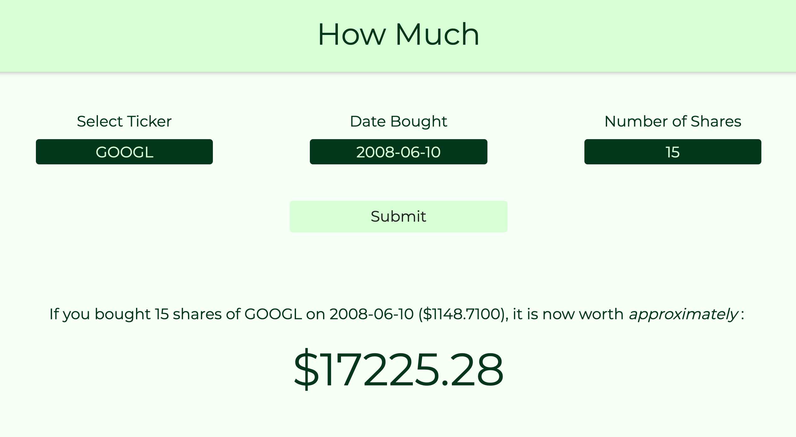

<!-- PROJECT LOGO -->
<br />
<p align="center">
    
</p>


# HowMuch

## Table of Contents
+ [About](#about)
+ [Built With](#built_with)
+ [Getting Started](#getting_started)

## About <a name = "about"></a>
I currently work as a developer at an investment company. I have the opportunity to fiddle around with a lot of data regarding stocks, bonds, etc. I was interested in what the returns would be today if you invested in certain stocks at some past date. There was no application online that I found that could take care of this request so I built one myself.


## Built With <a name = "built_with"></a>
* [Javascript](https://developer.mozilla.org/en-US/docs/Web/JavaScript)
* [jQuery](https://jquery.com)

## Getting Started <a name = "getting_started"></a>
These instructions will get you a copy of the project up and running on your local machine for development and testing purposes.

```Clone it and open index.html```
